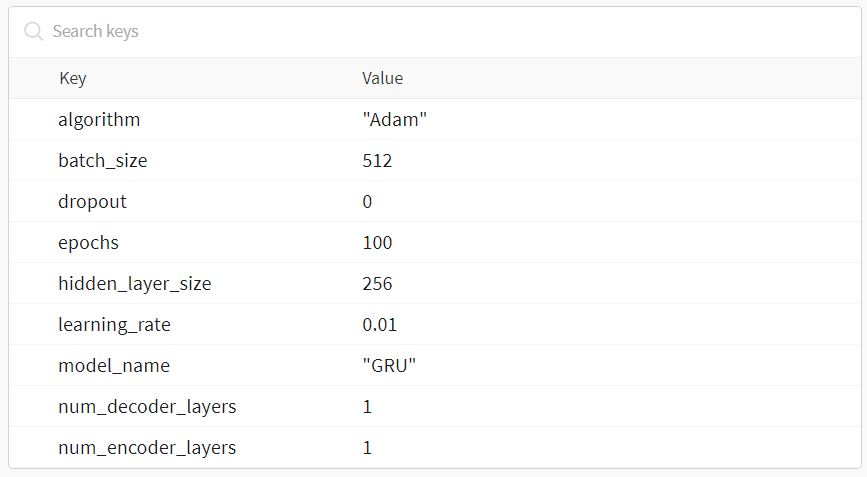

# CS6910_Assignment3
<h2> Submitted by : CS22M087 SUSMIT JAISWAL</h2>
This is a assignment on Transliteration given a input word in some language translate it into word of another language which sounds same.
Chosen 2 languages are <b>English</b> and <b>Hindi</b>  

<h3> Encoder Decoder Model </h3>
In this assignment i used various Encoder Decoder Model to handle the task of transliteration.
Various Encoder Decoder Model used in this assignment are:
<ul>
  <li> RNN (Recurrent Neural Network) </li>
   <li> LSTM (Long Short Term Memory) </li>
   <li> GRU (Gated Recurrent Unit </li>
  </ul>
  A simple encoder consist of input layer (with or without word embedding) a hidden layer(recursively connected to one another) and a output layer(not used in this task) and decoder consist of the same components.
  Then ,
  Add attention to the same models to 
  <h3> DATASET </h3> 
<a href="https://drive.google.com/file/d/1uRKU4as2NlS9i8sdLRS1e326vQRdhvfw/view">Akshantar Dataset</a>
Download the folkowing Dataset and extract it

 <h3 >Run the file on any platform: </h3>
 Download the file of .iypnb from the repository.
 Open it on google Colab / Jupyter / Kaggle.
 Download the necessary libraries.
 e.g. pip install wandb
 pip install pytorch
 pip install matplotlib
 and other libraries if not found and giving some error
 
 <h2>Change the path</h2>
 In the third cell change the path of three files <br>
 hin_valid.csv,<br>
 hindi_train_csv,<br>
 hindi_test.csv.<br>
 You can easily go the extracted folder and copy the path and paste it where the data it loaded.
 
```python
CSV_file = pd.read_csv('/kaggle/input/aksharantar/aksharantar_sampled/hin/hin_train.csv')
#print(CSV_file)

"""                           Loading the Dataset                         """

X_train = CSV_file.iloc[:, 0].values
#print(X_train)
Y_train = CSV_file.iloc[:, 1].values
#print(Y_train)

CSV_file_test = pd.read_csv('/kaggle/input/aksharantar/aksharantar_sampled/hin/hin_valid.csv')
#print(CSV_file)

"""                           Loading the Dataset                         """

X_test = CSV_file_test.iloc[:, 0].values
#print(X_train)
Y_test = CSV_file_test.iloc[:, 1].values
#print(Y_train)

print(" f1 Number of training samples: ", len(X_train))
print("f1 Number of test samples: ", len(X_test))
```
<b> Then you can RUN the file either on run button of notebook or 
  python file_name.py on pc </b><br>
<b> Recommended : </b>  to run on notebooks online provide option of GPU which is important requirement of this code.  
  

<h3> WANDB</h3>
For training purpose I used different parameters to learn better weights and used wandb to capture that :
<a href="https://drive.google.com/file/d/1uRKU4as2NlS9i8sdLRS1e326vQRdhvfw/view">Wandb Report</a> <br>
The following are the hyperparameter which wandb agent changed and plotted graph based on that.

```python
  sweep_config = {
  "name": "Bayesian Sweep",
  "method": "bayes",
  "metric":{
  "name": "WordLevel_Validation_Accuracy",
  "goal": "maximize"
  },
  "parameters": {
        "hidden_layer_size": {
            "values": [128,256,512]
        },
        "num_encoder_layers": {
            "values": [1]
        },
         "num_decoder_layers": {
            "values": [1]
        },
        "learning_rate": {
            "values": [0.005,0.01,0.05,0.02]
        },
        "optimizer": {
            "values": ['Adam','RMSprop','NAdam']
        },
        
        "batch_size": {
            "values": [512,128,256,1024]
        },
        
        "model_name": {
            "values": ["RNN","GRU","LSTM"]
        },
 
        
        "dropout": {
            "values": [0.0,0.1,0.2,0.3]
        },
                    
        "epochs": {
            "values": [100,50,125,150]
        },        
    }
}


```

<h3>Best accuray found without attention : <b> ~ 34 % </b></h3>


Only change in the sweeps of attention and without attention is number of layers in encoder and decoder is 1 as the option given in assignment guidelines
<h3>Best accuray found with attention : <b> ~ 42 % </b></h3>



<hr>
<h3> Vanilla Predictions and Attention Predictions </h3> 
After doing this in main file there is one more file to store the results of the test data on github repository
<br>
<br>
<b>Heatmap Code< : this can also me changed similarly as main iypnb file and run in same manner/b>
One more file which is also a .iypnb file to display the heatmaps on <b> English Word </b> and <b> Hindi Word</b>

<b>END</b>
